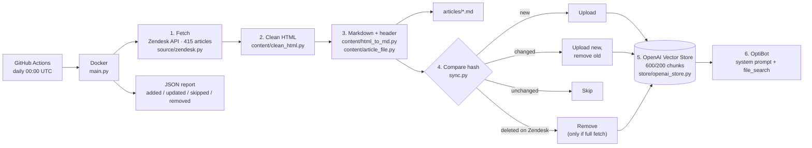

# Pipeline flow

```mermaid
flowchart LR
    CRON["GitHub Actions<br/>daily 00:00 UTC"] --> RUN["Docker<br/>main.py"]
    RUN --> FETCH["1. Fetch<br/>Zendesk API · 415 articles<br/>source/zendesk.py"]
    FETCH --> CLEAN["2. Clean HTML<br/>content/clean_html.py"]
    CLEAN --> MD["3. Markdown + header<br/>content/html_to_md.py<br/>content/article_file.py"]
    MD --> FILES["articles/*.md"]
    MD --> SYNC{"4. Compare hash<br/>sync.py"}
    SYNC -- new --> ADD["Upload"]
    SYNC -- changed --> UPD["Upload new,<br/>remove old"]
    SYNC -- unchanged --> SKIP["Skip"]
    SYNC -- deleted on Zendesk --> DEL["Remove<br/>(only if full fetch)"]
    ADD --> STORE[("5. OpenAI Vector Store<br/>600/200 chunks<br/>store/openai_store.py")]
    UPD --> STORE
    DEL --> STORE
    STORE --> BOT["6. OptiBot<br/>system prompt + file_search"]
    RUN --> LOG["JSON report<br/>added / updated / skipped / removed"]
```
